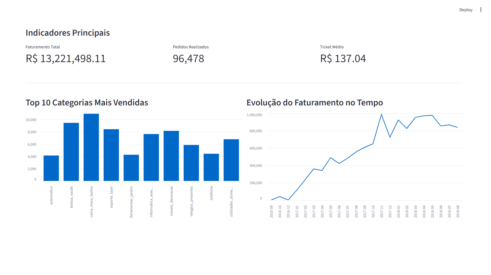

# 📊 Projeto Integrador - Grupo 23

---

## 📌 Tema do Projeto

**Análise de dados de vendas em e-commerce brasileiro**
> **🌍 Acesso ao Dashboard em Produção:**
> [Clique aqui para acessar o Streamlit Cloud](https://projeto-integrador-grupo23-wgheh5nnrs5uch8m53yue9.streamlit.app/)
---

## 👥 Integrantes

- **Debora Campagnaro Ramella**  
- **Filipe Coldebella**  
- **Francisco Rodrigues dos Santos**  
- **Mariana Bandeira Santos**  
- **Umbria Luiza Zuicker**
  
---

## 🚀 Como Executar o Projeto Localmente

1. Clone este repositório:
   ```bash
   git clone https://github.com/marianaabandeira/projeto-integrador-grupo23.git
2. Instale as Dependências
    ```bash
    pip install -r requirements.txt
3. Execute o Projeto
    ```bash
   streamlit run app/dashboard.py
---
   
## 🎯 Objetivo da Análise

O objetivo deste projeto é analisar os dados de vendas de um e-commerce brasileiro, com a finalidade de identificar padrões de consumo, comportamento dos clientes e desempenho das vendas, gerando insights que auxiliem na tomada de decisão.

---

## 🗂 Base de Dados

A base de dados utilizada será **Brazilian E-Commerce Public Dataset by Olist**, obtida através do **Kaggle**.

Essa base contém informações sobre pedidos realizados em um e-commerce brasileiro, incluindo dados como clientes, produtos, pagamentos, avaliações e entregas.
> **🎲 Acesso a Base de Dados no Kaggle:** [Brazilian E-Commerce Public Dataset by Olist](https://www.kaggle.com/datasets/olistbr/brazilian-ecommerce)
---

## ⚙️ Planejamento do Projeto

### 📌 Divisão de Tarefas

- **Debora Campagnaro Ramella**: Responsável pela análise dos dados e definição das métricas  

- **Filipe Coldebella**: Responsável pela coleta e organização da base de dados  

- **Francisco Rodrigues dos Santos**: Responsável pelo processo de ETL (extração, transformação e carga dos dados)  

- **Mariana Bandeira Santos**: Responsável pela organização do projeto, criação e gerenciamento do repositório no GitHub, definição das tarefas, prazos e acompanhamento do grupo  

- **Umbria Luiza Zuicker**: Responsável pelo desenvolvimento do dashboard (Streamlit)  

---

### 📅 Cronograma

- **Semana 1:** Escolha da base de dados, definição do tema e organização do repositório no GitHub  

- **Semana 2:** Coleta e tratamento dos dados (processo de ETL: extração e transformação)  

- **Semana 3:** Análise dos dados e definição das métricas e insights  

- **Semana 4:** Desenvolvimento do dashboard e finalização do projeto  

---

### 🔄 Transformações dos Dados (ETL)

Durante o processo de ETL, foram realizadas as seguintes etapas:

- **Extração:** Os dados foram obtidos através da base disponibilizada no Kaggle  
> **🎲 Acesso a Base de Dados do Kaggle:** [Brazilian E-Commerce Public Dataset by Olist](https://www.kaggle.com/datasets/olistbr/brazilian-ecommerce)
- **Transformação:**
  - Limpeza de dados (remoção de valores nulos e duplicados)  
  - Padronização de formatos (datas, valores, categorias)  
  - Integração das tabelas (clientes, pedidos, produtos, etc.)  
  - Foram criadas novas colunas para análise (ex: faturamento total, tempo de entrega)  

- **Carga:** Os dados tratados foram armazenados em arquivos estruturados (CSV) que logo após foram utilizados no projeto  

---

## 📊 Planejamento do Dashboard

O dashboard apresenta as seguintes informações:

- **Faturamento total**  
- **Produtos mais vendidos**  
- **Evolução das vendas ao longo do tempo**  
- **Ticket médio**  

Tipos de visualização:

- **Gráfico de barras (produtos mais vendidos)**  
- **Gráfico de linha (evolução das vendas)**  
- **Indicadores (KPIs principais)**  

---

## 🛠 Tecnologias Utilizadas

- **Python**  
- **Pandas**  
- **Streamlit**  
- **GitHub**  

---

## 💡 Ideia Inicial do Projeto
O ** projeto **  consiste na aplicação de um processo de ETL para tratamento dos dados de vendas de um e-commerce brasileiro e, posteriormente, no desenvolvimento de um dashboard interativo que permita visualizar e analisar as principais métricas e insights obtidos.

Dashboard do Projeto

---
